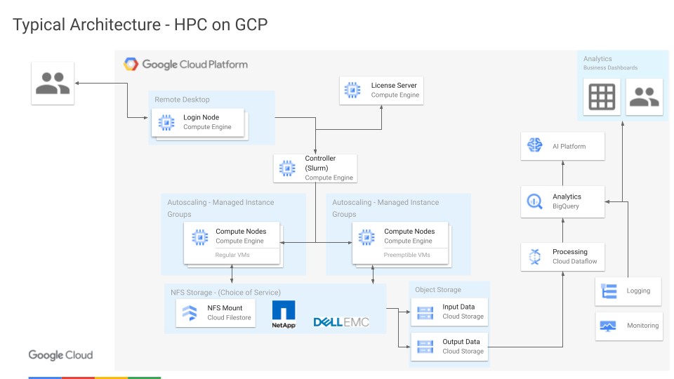

# Example - Running an isolated Slurm using GPUs on Google Cloud

Here are some example template snippets used to spin up Google Cloud resources
to run a Slurm cluster of GPUs on Google Cloud.

Please note that these are provided only as examples to help guide
infrastructure planning and are not intended for use in production. They are
deliberately simplified for clarity and lack significant details required for
production-worthy infrastructure implementation.

This is an example of running an isolated gpu-based Slurm cluster.  While
"hardened" might be too strong of a term here, this is an example of how to build
a gpu-based Slurm cluster that might be a little closer in line with what
your IT Security folks want you to do.  It's an example of how to run
a gpu-based Slurm cluster with no access to the outside world as well as
a handful of other security-specific config variations.



In this example, you'll create:
- A dedicated Identity and Access Management (IAM) **Service Account** w/ appropriate
  roles adopting a "Principle of least privilege" approach.
- A Customer-Managed Encryption Key (**CMEK**) used to encrypt all storage.
- A dedicated instance ready for you to install basic **license server** needs.
- A dedicated **isolated network** with no ingress or egress traffic allowed.
- And then a **slurm cluster with GPU-based partitions**.


## Costs

If you run the example commands below, you will use billabisolated-le components of
Google Cloud Platform, including:

- Compute Engine
- Cloud Filestore

You can use the
[Pricing Calculator](https://cloud.google.com/products/calculator)
to generate a cost estimate based on your projected usage.

Check out the [Google Cloud Free
Program](https://cloud.google.com/free/docs/gcp-free-tier) for potential
credits for tutorial resources.

## Before you begin

Start by opening
[https://console.cloud.google.com/](https://console.cloud.google.com/)
in a browser.

Create a new GCP Project using the
[Cloud Resource Manager](https://console.cloud.google.com/cloud-resource-manager).
The project you create is just for this example, so you'll delete it below
when you're done.

You will need to
[enable billing](https://support.google.com/cloud/answer/6293499#enable-billing)
for this project.

You need to enable Compute Engine and Filestore services as enabling these APIs
allows you to create the required resources.

[Enable Example Services](https://console.cloud.google.com/flows/enableapi?apiid=compute.googleapis.com,file.googleapis.com,cloudresourcemanager.googleapis.com)
    
Next, make sure the project you just created is selected in the top of the
Cloud Console.

Then open a Cloud Shell associated with the project you just created

[Launch Cloud Shell](https://console.cloud.google.com/?cloudshell=true)

It's important that the current Cloud Shell project is the one you just
created.  Verify that

```bash
echo $GOOGLE_CLOUD_PROJECT
```

shows that new project.

All example commands below run from this Cloud Shell.


## Example source

Get the source

```bash
git clone https://github.com/mmm/slurm-on-gpus
cd slurm-on-gpus
```

All example commands below are relative to this top-level directory of the
examples repo.

## Tools

We use [Terraform](terraform.io) for these examples and the latest version is
already installed in your GCP Cloudshell.


## Create some preliminary resources

Create a Service Account and a CMEK to use when we create all of the compute
resources used in this project:

```bash
cd terraform/setup
terraform init
terraform plan
terraform apply
```

The output of this command will display links for the Service Account and CMEK.
We'll need those in later steps.


## Create a tutorial network

Create a network dedicated to the gpu cluster instead of using the `default`
network for the project we created.

```bash
cd terraform/network
terraform init
terraform plan
terraform apply
```

This creates an network and reserves a static IP address for the license server
you build in the following section.

Note that this does not allow for egress from the network.  If you'd like that
uncomment the NAT routers in the `terraform/network/main.tf` Terraform template.

The output of this command will display the IP address reserved for the license
server.


## Create a license server

Create an instance used to run a license manager in GCP.

Change to the `licensing` example directory

```bash
cd terraform/licensing
```

Copy over the template variables

```bash
cp licensing.tfvars.example licensing.tfvars
```

Edit `licensing.tfvars` to set some missing variables.

You can optionally edit 3 fields: the service account and the encryption key
(output of the setup step above) as well as the static internal IP we've
reserved for the license server (output of the network step above).

Near the top, edit

```terraform
cmek_self_link = "<my_key_self_link>"
service_account =  "<my_service_account_email>"
license_server_internal_static_ip = "<my_reserved_internal_ip>"
```

Next, spin up the license server

```bash
terraform init -var-file licensing.tfvars
terraform plan -var-file licensing.tfvars
terraform apply -var-file licensing.tfvars
```

This creates an example instance.  Note that in this example, the normal
`provision.sh` script used to customize the instance after startup won't work
because we're not allowing egress from the example environment. The use of this
script is commented out in the `licensing/main.tf`.

Note that [Sole-Tenant Nodes](https://cloud.google.com/sole-tenant-nodes)
are available and commonly used for license and key-management servers.

This process should complete in a few minutes. Once this step is successful,
you can navigate to the Compute Instances view and should see the new resource.


## Create a Slurm cluster

Create an example slurm cluster with a single `debug` partition that scales
dynamically in GCP.

Change to the slurm cluster example directory

```bash
cd terraform/isolated-gpu-cluster
```

Copy over the template variables

```bash
cp gpu.tfvars.example gpu.tfvars
```

Edit `gpu.tfvars` to set some missing variables.

You need to edit several fields:


### Edit the project

Near the top, the project name (required) and the zone should match everywhere

```terraform
project      = "<project>" # replace this with your GCP project name
```

### Edit the CMEK used to encrypt disks and storage

Uncomment
```terraform
# cmek_self_link = "projects/<project>/locations/global/keyRings/tutorial-keyring/cryptoKeys/tutorial-cmek"
```
and set this variable to the value output from the setup step above.


### Edit Service Account used for the various Slurm node types

Uncomment the following variables throughout the file
```terraform
# controller_service_account = "default"
# login_node_service_account = "default"
# compute_node_service_account = "default"
```
and set the value of each to the value output from the setup step above.


### Spin up Slurm

Next spin up the cluster.
Still within the Slurm example directory above, run

```bash
terraform init
terraform plan -var-file gpu.tfvars
terraform apply -var-file gpu.tfvars
```

and wait for the resources to be created.  This should only take a minute or two.


## Run Slurm jobs

Log into the Slurm login node

```bash
gcloud compute ssh <cluster_name>-login0 --zone <zone>
```

for example

```bash
gcloud compute ssh gpu-login0 --zone us-central1-f
```

which should show something like the following

```sh
External IP address was not found; defaulting to using IAP tunneling.
Warning: Permanently added 'compute.1234567' (ECDSA) to the list of known hosts.


                                 SSSSSSS
                                SSSSSSSSS
                                SSSSSSSSS
                                SSSSSSSSS
                        SSSS     SSSSSSS     SSSS
                       SSSSSS               SSSSSS
                       SSSSSS    SSSSSSS    SSSSSS
                        SSSS    SSSSSSSSS    SSSS
                SSS             SSSSSSSSS             SSS
               SSSSS    SSSS    SSSSSSSSS    SSSS    SSSSS
                SSS    SSSSSS   SSSSSSSSS   SSSSSS    SSS
                       SSSSSS    SSSSSSS    SSSSSS
                SSS    SSSSSS               SSSSSS    SSS
               SSSSS    SSSS     SSSSSSS     SSSS    SSSSS
          S     SSS             SSSSSSSSS             SSS     S
         SSS            SSSS    SSSSSSSSS    SSSS            SSS
          S     SSS    SSSSSS   SSSSSSSSS   SSSSSS    SSS     S
               SSSSS   SSSSSS   SSSSSSSSS   SSSSSS   SSSSS
          S    SSSSS    SSSS     SSSSSSS     SSSS    SSSSS    S
    S    SSS    SSS                                   SSS    SSS    S
    S     S                                                   S     S
                SSS
                SSS
                SSS
                SSS
 SSSSSSSSSSSS   SSS   SSSS       SSSS    SSSSSSSSS   SSSSSSSSSSSSSSSSSSSS
SSSSSSSSSSSSS   SSS   SSSS       SSSS   SSSSSSSSSS  SSSSSSSSSSSSSSSSSSSSSS
SSSS            SSS   SSSS       SSSS   SSSS        SSSS     SSSS     SSSS
SSSS            SSS   SSSS       SSSS   SSSS        SSSS     SSSS     SSSS
SSSSSSSSSSSS    SSS   SSSS       SSSS   SSSS        SSSS     SSSS     SSSS
 SSSSSSSSSSSS   SSS   SSSS       SSSS   SSSS        SSSS     SSSS     SSSS
         SSSS   SSS   SSSS       SSSS   SSSS        SSSS     SSSS     SSSS
         SSSS   SSS   SSSS       SSSS   SSSS        SSSS     SSSS     SSSS
SSSSSSSSSSSSS   SSS   SSSSSSSSSSSSSSS   SSSS        SSSS     SSSS     SSSS
SSSSSSSSSSSS    SSS    SSSSSSSSSSSSS    SSSS        SSSS     SSSS     SSSS


[some_user_example_com@piton-login0 ~]$
```

At the prompt you can run various slurm commands.

For general cluster info you can use
the [`sinfo`](https://slurm.schedmd.com/sinfo.html) command and see something like the following output. 

```bash
[some_user_example_com@piton-login0 ~]$ sinfo
PARTITION AVAIL  TIMELIMIT  NODES  STATE NODELIST
debug*       up   infinite     10  idle~ piton-compute-0-[0-9]
```

The [`squeue`](https://slurm.schedmd.com/squeue.html) command will provide information on the job queue. You can run a synchronous job on 2 nodes using
[`srun`](https://slurm.schedmd.com/srun.html)

<!-- Note test this command to get sleep processes across both nodes -->
```bash
srun -N 2 sleep 300
```

You can submit batch script to the queue using
[`sbatch`](https://slurm.schedmd.com/sbatch.html).

Notice the first time you run any sort of job on Slurm it will take a little
longer because it's dynamically spinning the resources (compute nodes) it needs
in GCP.  Please also note that these resources spin back down when not in use.
You can set the time a compute node sits idle using `suspend_time` in the
`gpu.tfvars` cluster config.


## Run a GPU-intensive job

Once the cluster is up, you are ready to run jobs.

Since the cluster has no access to the outside world, the easiest way
to transfer files to/from the login node is to use Google Cloud Storage (GCS).

The easiest thing to do is create a bucket in the Cloud Console, add files
you need to that bucket, and then copy them directly from the login node.

From the login node, download any files from GCS using something like

```sh
gsutil ls gs://
gsutil ls gs://<my-cool-bucket-name>/
gsutil cp gs://<my-cool-bucket-name>/<some-filename> .
```

You can then extract and kick off jobs with slurm commands like `srun`,
`sbatch`, `salloc`, etc... mentioned in the previous sections.

You can use `sinfo` and `squeue` to view progress.


## Cleaning up

To avoid incurring charges to your Google Cloud Platform account for the
resources used in this tutorial:

### Delete the project using the GCP Cloud Console

The easiest way to clean up all of the resources used in this tutorial is
to delete the project that you initially created for the tutorial.

Caution: Deleting a project has the following effects:
- Everything in the project is deleted. If you used an existing project for
  this tutorial, when you delete it, you also delete any other work you've done
  in the project.
- Custom project IDs are lost. When you created this project, you might have
  created a custom project ID that you want to use in the future. To preserve
  the URLs that use the project ID, such as an appspot.com URL, delete selected
  resources inside the project instead of deleting the whole project.

1. In the GCP Console, go to the Projects page.

    [GO TO THE PROJECTS PAGE](https://console.cloud.google.com/cloud-resource-manager)

2. In the project list, select the project you want to delete and click Delete
   delete.
3. In the dialog, type the project ID, and then click Shut down to delete the
   project.

### Deleting resources using Terraform

Alternatively, if you added the tutorial resources to an _existing_ project, you
can still clean up those resources using Terraform.

From the `isolated-gpu-cluster` sub-directory, run

```bash
terraform destroy -var-file gpu.tfvars
cd ../licensing
terraform destroy -var-file licensing.tfvars
cd ../network
terraform destroy
```

(note that destroying the network removes our reserved internal IP address
we used for the license server.  That might cause you some grief if you
locked the license to that MAC address.

...and then optionally,
```bash
cd ../setup
terraform destroy
```
to clean up the rest.

## What's next

There are so many exciting directions to take to learn more about what you've
done here!

- Infrastructure.  Learn more about
  [Cloud](https://cloud.google.com/),
  [Slurm](https://slurm.schedmd.com/overview.html),
  High Performance Computing (HPC) on GCP
  [reference architectures](https://cloud.google.com/solutions/hpc/) and 
  [posts](https://cloud.google.com/blog/topics/hpc).

